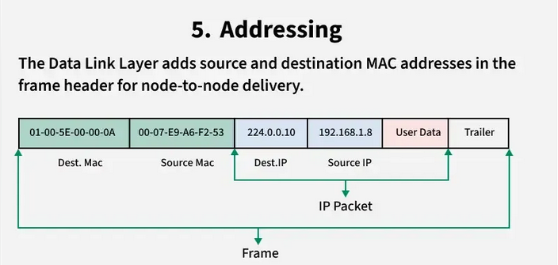
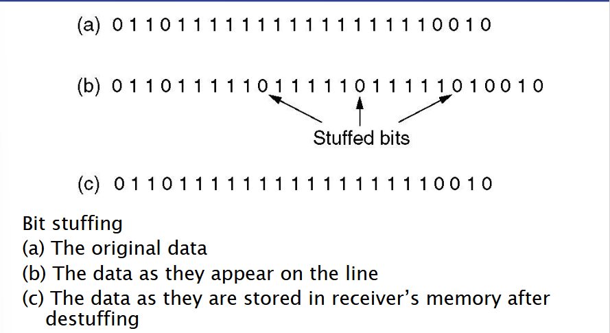
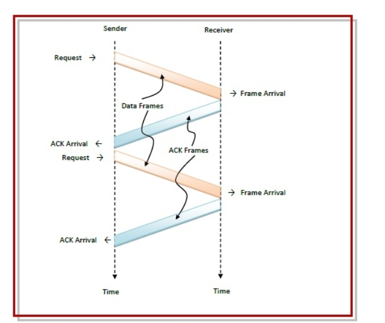

# Data Link Layer

## Functions:
- Framing
- Error Detection: `Parity Check`, `Hamming Distance`
- Error Correction
- Flow Control: `Stop-and-wait`, `Sliding window`
- Addressing

# Connectionless Services:
- `Frames` are sent `once`

| Unacknowledged connection-less service | Acknowledged connection-less service |
|----------------------------------------|--------------------------------------|
| No Acknowledgement sent back by receiver | The receiver acknowledges received `frames`|
| if `frame` is lost or destroyed => `No resending`| if `ACK` is missing for too long => `send Frame again`|
| Usefull for highly reliable transmission mediums | Usefull for less reliable transmission mediums |
| Error Handling on higher levels | `Frames` could appear twice</br> - if `ACK` came too late or was lost |

# Connection-Oriented Service: 
- Acts like a `reliable bit stream`
- Guarantees that:
  - All `frames` eventually reach the receiver
  - every `frame` appears exactly once
  - `Frames` appear in the correct order
- Connection Management: 
    - Establish a `connection`
    - Send data
    - Shutdown the `connection`
- Ordering: `frames` are numbered
-----
# Framing:

## how does a frame look like?


| Sending Machine                                                                                                       | Receiving Machine                                                                                   |
|-----------------------------------------------------------------------------------------------------------------------|-----------------------------------------------------------------------------------------------------|
| receives a `Packet` from the `Network Layer`                                                                          | Receives a `bitstream` from the `Physical Layer`.                                                   |
| `Data Link Layer` converts the packet into a `Frame` including : </br> - Header </br> - Payload field </br> - Trailer | The `Physical Layer` reassembles the `bitstream` into a Frame and forwards it to the Data Link Layer. |
| Forwards the `Frame` into the `Physical Layer` where it is converted to `bitstream` | `The Data Link Layer` processes the `Frame`, validates it, and extracts the `Packet`.               |
|                                                                                                                       | Forwards the `Packet` to the `Network Layer` for further processing.                                    |


# Stuffing Bits: 
> A Frame must not contain `111 111`
- insert a `stuffing bit` after 5 `11 111`
- `111 111` => `111 110 1`
- **Overhead:** 1 `Stuffing bit` after 5 `payload bits`


-----
# Error Detection and Correction

## Hamming Distance: 
`h` = the minimum of number of different bits

`d` = h - 1 To **Detect** `d` errors
- to **Correct** `d` errors:
$$  
d = \frac{h - 1}{2}
$$

## Parity Bits:
> number of `1-bits`  is odd => Error
- if `1-bits` is **even** => add `0-bit`
- if `1-bits` is **odd** => add a `1-bit`

### Observations:
- One Parity Bit per Block
- Fits with every block size
- each bit has the same error probability
- Large blocks => more errors => more parity bits
- to detect errors: need hamming distance `h = d + 1`
- `d` parity bits to detect `d` errors
- more parity bits => longer blocks => more errors

# [7,4] Binary Hamming Code(Youtube)

----
# Elemantary Data Link Protocols

# Simplex Protocols:
- very restricted
- only one-way communication 

## An Unrestricted Simplex Protocol
- Sender never stops or slows down => `sender is continuously sending data`
- Receiver is continuously reading and processing => `Receiver is fast enough and can process all information sent`
- Receiver can not send to the sender `One way communication`
- No errors

## Simplex Stop and wait protocol

```shell
begin
   while (true)      //check repeatedly
   do
      Wait_For_Event();     //wait for arrival of frame
      if ( Event(Frame_Arrival) then
         Receive_Frame_From_Physical_Layer();
         Extract_Data();
         Deliver_Data_To_Network_Layer();
         Send_ACK();
      end if
   end while
end
```


**Problem to solve:**
  - The `receiver` might be too slow to process al data sent => `sender` must slow down

**Possible Solutions**
  - The sender pauses between two `frames`(`worst case processing time` of the receiver required)
  - the receiver tells the sender when to continue(Requires a `Back Channel`)

## A Simplex Protocol for a Noisy Channel
**Sender:**
- Send `Frame` `m`
- Wait for `ACK` or `timeout`
- `ACK` for frame `m` => send frame `m+1`
- `Timeout` => Send Frame again

> after sending frame `m` can receive `ACK` for frames `m` and `m - 1`

**Receiver:**
- Waiting for frame `m`
- Receive frame `x`
- `x = m` => `m := m + 1`
- `ACK` frame `x`

> after receiving frame `m` it can receive frame `m` again and frame `m + 1`

# Sliding Window Protocols
- Every frame has a `n-bit` sequence number in range `0.....(2^n)-1`
- Each `sender` has a `Window` which holds `2^n` frames, 
- The sender can `retransmit` every frame in the window
- each receiver has a window, which holds `2^m` frames
- the receiver accepts all frames in this window
- Two way communication (`Each node acts as a sender and a receiver`)
- `ACK` are piggypacked on outgoing frames