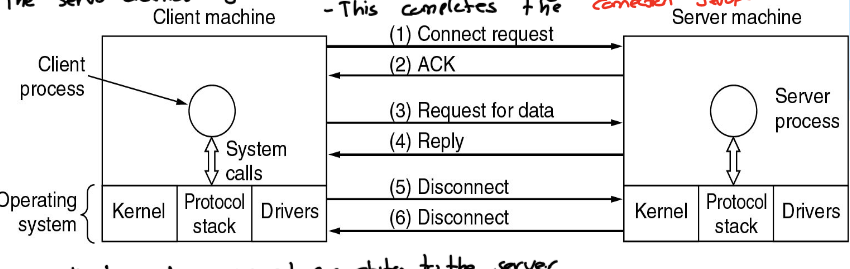

# Client-Server Networks
- Involves requests and replies
## Components: 

- **Client:**
    Computer or advice used by a person, `requests` services or applications
- **Server:** 
    `Responds` to Client requests, can test websites, and cahnge databases.

## Workflow
- `Client` sends requests to the `server`
- `Server` processes the request, then gives a `response` or reserve back to the clients
 
- `Network` creates a `centralized` system 

>  **Server** playes a crictical role in managing resources for multiple clients

---
# Peer-to-Peer Networks

## Properties:
- no fixed `clients` and `servers`
- many `peer-to-peer`systems **do not have** a `central database` for content
- **Each user** has a `local database` of content

## Examples:
- Email
- Social Network apps: Facebook, Wiki,.....

-----
# Types of transmission technology

| Type                 | Properties                                                                                                     | Example             |
|----------------------|----------------------------------------------------------------------------------------------------------------|---------------------|
| **Broadcast links**  | `Single Communication` Channel is Secured by `all devices of network`                                          | TV, Radio Broadcast |
|                      | Data sent by one device can be `recieved by all` other devices on the network but only `processed by intended` |                     |
| Point-to-point links | `Direct Communication` between two devices                                                                     | Wired Connections   |
|                      | Data is transmitted from `one sender` to a `single reciever` along a dedicated Channel                         | telephone lines for 1 to 1|
------
# Network Types:

| Type                            | Definition/Connects/Size/Types                                                                                     | Connection                                                                           | Pro                                                                                                              | Contra                                                            |
|---------------------------------|--------------------------------------------------------------------------------------------------------------------|--------------------------------------------------------------------------------------|------------------------------------------------------------------------------------------------------------------|-------------------------------------------------------------------|
| Local Area Networks`LAN`        | small scale connecting multiple knots                                                                              | Bus/Ring Broadcast networks                                                          | Simple, less cabling                                                                                             | Central dead => all dead, performance decreases with more devices |
| Metropolitan Area Networks`MAN` | Larger than `LAN` smaller than `WAN` connects buildings or houses in a city or a region                            | Cable TV: `Antenna` + `Head end` + `junction boxes` connectets `recipients`via `bus` | `centralized infrastructre` is cost effective, supports TV, Internet, Telecomunication throught the same network | /                                                                 |
| Wide Area Networks`WAN`         | Backbone of large scale networks like the `Internet`, where `LAN`s are interconnected through `Routers` and `Subnet` | `Subnet` Connecting `LAN`s of Hosts, communication between them via `Routers`        | /                                                                                                                | /                                                                 |
| Wirless Networks                | `WLAN` `WWAN` `System interconnection`                                                                             |                                                                                      |                                                                                                                  |                                                                   |
| Home Networks                   |                                                                                                                    |                                                                                      |                                                                                                                  |                                                                   |
| Internetworks                   |                                                                                                                    |                                                                                      |                                                                                                                  |                                                                   |
------------
# Network Software:
- Split into `Layers`
- Each Layer communicates according to a `Protocol: (IP, TCP, UDP)`
- Each Layer provides a service to the upper layer via an `Interface`, Layers work **independently** and don't know how other Layers are working
- The layered protocols form a `Protocol Hierarchy`

**Communication Protocol**": Handshake to exchange data between computers

**Network architecture**: Set of `Layers` and `Protocols`

**Protocol Stack**: A list of `Protocols` used by a certain System, one `Protocol` per `Layer`

**Layers**: `Divide` communication tasks for `modularity`

**Protocols**: `Enable` communication between corresponding `Layers`

**Interfaces**: `Facilitate` dataflow between adsacent `Layers`

**Physical Meduim**: `Connects` the lowest Layers of the two hosts ensurring data is transmitted between them

## Workflow
#### Source Machine:
- Each `Layer` adds a `Header` to the `Message`/`Data`
- if the `Data` is two big it will be splitted to multiple `Packets` in the corresponding Layer
- last `Layer` adds a `Trailer` and a `Header`

#### Destination Machine
- first Layer removes the `Trailer and the Header
- Each Layer removes a `Header`
- if there are more `Packets` they will be joined

## Design Issues for the Layers

- Connecton-Oriented or Connection-less (Reliabiltity vs Speed)
- Addressing(Correct Delivery)
- Error Control
- Flow Control
- Multiplexing(Optimizes resource storage)
- Routing(Efficient Delivery)

| Connection Oriented                                | Connectionless                                          |
|----------------------------------------------------|---------------------------------------------------------|
| Connection is opened(`handshake`)                  |                                                         |
| `sequence` of data is being sent                   | Each `Datagram` travels independently of others         |
| Connection is closed (`handshake`)                 |                                                         |
| Network knows to which connection the data belongs | Network does not know about relationship of `Datagrams` |
| `Error Correction`, `Flow Control`, `Ordering`     | Typically no `flow control` or `datagram` ordering      |
| Reliable, Ordered communication                    | Lightweight communication without garantees             |

------
# Service Primitives

- Essential Operations for implementing a `Connection-Orientated` service in networking

| Primitive  | Meaning                                    |
|------------|--------------------------------------------|
| LISTEN     | Block Waiting for an incoming connection   |
| CONNECT    | Establish a connection with a waiting peer |
| RECEIVE    | Block waiting for an incoming message      |
| SEND       | Send a message to the peer                 |
| DISCONNECT | Terminate a connection                     |

----
# Reference Models

| OSI          | TCP/IP          | **Hybrid Modell** |
|--------------|-----------------|-------------------|
| Application  | Application     | Application       |
| Presentation | /               |                   |
| Session      | /               |                   |
| Transport    | Transport       | Transport Layer   |
| Network      | Internet        | Network Layer     |
| Data link    | /               | Data Link Layer   |
| Physical     | Host-to-Network | Physical Layer    |

> The `OSI` modell is theoritical for understanding, while the `TCP/IP` is practical and widely used for internet communication
> The `OSI` allow **(in theory)** to replace layers
> The `TCP/IP` does not distingush between `Service`, `Interface`, and `Protocol`

----
# Layer Functionality

| Layer     | Job                                                                  | Protocols                    |
|-----------|----------------------------------------------------------------------|------------------------------|
| App       | Exchange of application-related Data                                 | DNS, FTP, HTTP, SMTP, TELNET |
| Transport | Data Correction, end-to-end Communication, flow control, reliability | TCP, UDP                     |
| Internet  | Routing and directing packets through the network                    | IPv6, IPv4                   |
| Data Link | Physical transmission                                                | Ethernet                     |

----

# IEEE 802 Standards

| Name   | Topic                                |
|--------|--------------------------------------|
| 802.3  | Ethernet                             |
| 802.11 | WLAN                                 |
| 802.15 | Personal Area Networks (`Bluetooth`) |
| 802.16 | Broadband wireless                   |

-----

# Formels and Exam questions

-  $$Overhead= \frac {n * H}  {n * H + M}$$
- **`Backbone`** Networks build the core of todays Internet 
- A local `Internet Service Provider` is a `Backbone Network` which is connected to a `Network Access Point`
- Clients can connect with the Network using a `Point of Presence`
