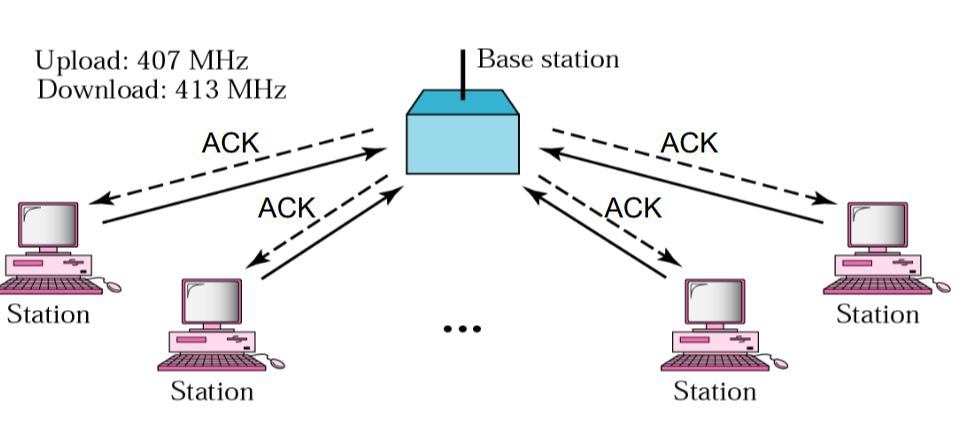

# Meduim Access Control (MAC):
- its a Sublayer of the `Data Link Layer`
- its used to send `Frames` between 2 Devices
- it should be made sure that a Device only sends one `Frame` at a time and not more

-----
# Channel Allocation Problem

## Collision:
> Multiple Stations access one channel, `all collided packets are lost` => waste of `Bandwidth`

### How to avoid Collisions?
- **Static Channel Allocation** => Simple
- **Dynamic Channel Allocation** => Efficient

### MAC Protocol for a broadcast channel with R bit/sec
- if only one node is sending => `throughput = R`
- if M nodes are sending => `throughput = R/M`
- Decentralized protocol => `no Master`
- Simple and inexpensive to implement

## MAC Medium Access Control:
- is required when multiple stations want to put `frames` on the medium (wire) at the same time
- is a `Sublayer` of the `Data Link Layer`
- is **NOT** a part of the `OSI Model`

----
# Static Channel Allocation:
> every one has one minute to speak, but what if one don't have nothing to say => the next person is still gonna have to wait for that one's minute to finish
- One Channel has the Medium the rest don't have a medium
- **Multiplexing:** putting `multiple Data Flows` on one channel
- **Frequency Division Multiplexing (FDM)**
- **Time Division Multiplexing (TDM)**
 > Static => Division Multiplexing
- **Contra:** might end up in unused `time slots`/`frequency bands`

## Frequency Division Multiplexing
> Works just like a Chord on a musical instrument, input = many notes of different frequencies at the same time, output = a harmonized understandable sound from the same instrument
> Dividing Frequencies
## Time Division Multiplexing
> Percussionist, Dividing the Channel to Bars per Beats, every instrument playes on its beat and grooves 

| Frequency Division Multiplexing                           | Time Division Multiplexing                                    |
|-----------------------------------------------------------|---------------------------------------------------------------|
| `n` Stations on a `Cable`  Channel bandwidth = `H`    | Channel transfer `B` bit/sec `n` stations on a cable      |
| Divide bandwidth to `H/n frequency bands`              | `n` time slots of length `t`                                  |
| Assign one `Band` to one `Station`                        | Round Robin  Each Station transfers `B * t` bits per slot |
| No Collision possible :)                                  | No collision :)                                               |
| Bandwidth decreased by factor `n` for every single user :( | Bandwidth decreased by factor `n` for every single user :(    |
----
# Dynamic Channel Allocation:
- Channels which have more `frames(data)` to send, gets more Medium, and the ones which has less Data to send(Frames to put on wire) gets less Medium

| Station Model                       | Single Channel Assumption                          | Collision Assumption                                                                                          | Continuous Time                          | Slottet Time                                  | Carrier Sense                                 | No Carrier Sense                               |
|-------------------------------------|----------------------------------------------------|---------------------------------------------------------------------------------------------------------------|------------------------------------------|-----------------------------------------------|-----------------------------------------------|------------------------------------------------|
| `n` independent stations            | All station connected to the same `channel`          | Two stations sending at `overlapping time intervals`  => collision    the transmitted data is garbled | Time is not Slotted                      | time is slotted                               | Channels are either busy or idle              | Station can not sense the channel              |
| Each Station wants to send `Frames` | All stations are equivalent                        | after collision `data must be sent again`                                                                     | Stations can attempt to send at any time | Frame transmition at beginning of a time slot | Station can sense if the channel is busy      | Stations just transmit                         |
| $\lambda$ is constant arrival rate  | Every station can send and recieve                 | Stations can detect collisions                                                                                |                                          |                                               | before sending the station checks the channel | after sending the station knows whether it was |
| P(Frame_Send) = $\lambda* \delta t$ | `Optional`: Priorities can be assigned to stations | no other errors, only collisions                                                                              |                                          |                                               |                                               | `Problem:` A transmition has been destroyed    |

> Carrier Sense helps in avoiding collisions but its still possible that a collision accure when two channels send frames at the same point, `Because of Signal Time which could cause delay`.
> Carrier Sense does not always help in **wireless connections** and thats because not all channels can sense each other rather just the two connected channels, this could cause problems like the hidden station problem

----
# Multiple Access Protocols(MAP)
- ALOHA (No Carier Sense)
- CSMA: Carrier Sense Multiple Access `important`
- Collision Free Protocols
- Limited-Conetention Protocols
----
# ALOHA Protocol:
- `Problem:` No Carrier Sense, only Base Channel knows whats happening => sends `ACK`
- No `ACK` => Collision happened
- Cabless

### Protocol: 
- `M` Nodes can `create`/`send` new `Frames` at `any Time`
- The Node immediately transmits its `frame` on a `shared frquency` 
- Base Station `acknowledges` a frame in a `dedicated frequency`
- if `collision` => no `ACK`
- Retransmission with probability `P` => avoids efficiency to become 0 
> `P` quality depends on how many stations on Channel
- **Vulnerability time** = 2t

## Slotted ALOHA:
- Create Time Slots
- Stations can only send at the beggining of a time slot
=> **Vulnerability time** is reduced to 2t and throughput is doubled
**Problem:** how does everybody agree on time slots
----
# CSMA Carrier Sense Multiple Access:
- **Goal**: `Minimize` collisions and increase `performance`
- A station `follows` the activity of other stations => Cable connection => Carrier Sense
- 1- Check if Channel is free before sending
- 2- if another channels begins sending at the same time stop sending

## How do Collisions accure?

**Whats the problem with a fast network in Carrier Sense?**
- huge `overhead`, a frame should be so big to cover `2t` of sending time => a situation could come with `1bit` data and `1000bit` overhead.

# 1-persistent CSMA:
- Listen before transmitting(`listning the whole time`)
- if channel busy, wait until channel is idle then transmit
- if collision, wait a random amount of time and start all over again
- **why is it called 1-persistent?**
> because station is sending with a probability of 1 whenever the channel is idle

> best time to use one only one channel want to send

# Nonpersistent CSMA
- Listen before transmitting (`Not listening the whole time`)
- if busy wait a random amount of time then sense the channel again
- if idle send packet immediately
- if collision, wait a random of time and start all over again

**speciality:** Station is not listening the entire time => not so greedy as `1-persistent`

# P-persistent CSMA
- Applies to slotted channels
- listen before transmitting 
- if channel is busy, wait until channel is idle
- if idle: 
  - transmit with probability of `p`
  - wait for next slot with probability `q = 1-p`
- if collision start over again

|                | 1-Persistent CSMA                                                | Nonpersistent CSMA                                               | n-Persistent CSMA                                                                                 | 
|----------------|------------------------------------------------------------------|------------------------------------------------------------------|---------------------------------------------------------------------------------------------------|
| **Start**      | listen before transmitting                                       | listen before transmitting                                       | listen before transmitting                                                                        |
| **Busy**       | if busy wait until idle then transmit                            | if busy wait a random amount if time then sense again            | if busy wait until idle                                                                           |
| **Idle**       | if idle send immediately with probability `p = 1`                | if idle send packet immediately                                  | if idle send packet with probability `p`  or wait till next slot with probability `q = 1 - p` |
| **Collision**  | if collision, wait a random amount of time then start over again | if collision, wait a random amount of time then start over again | if collision, wait a random amount of time then start over again                                  |
| **Speciality** | Greedy, sends always when Idle channel                           | not listening the entire time, less greedy than `1-persistent`   | not always sending and it depends on `transmission probability`                                   |

