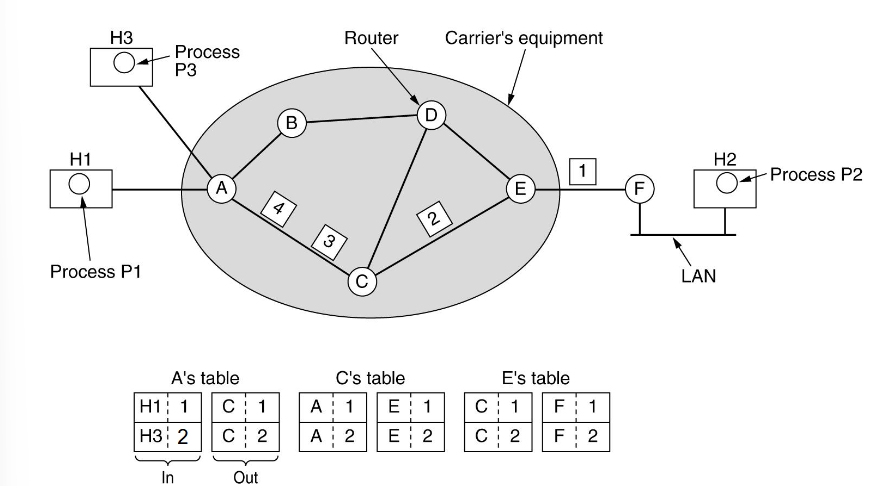
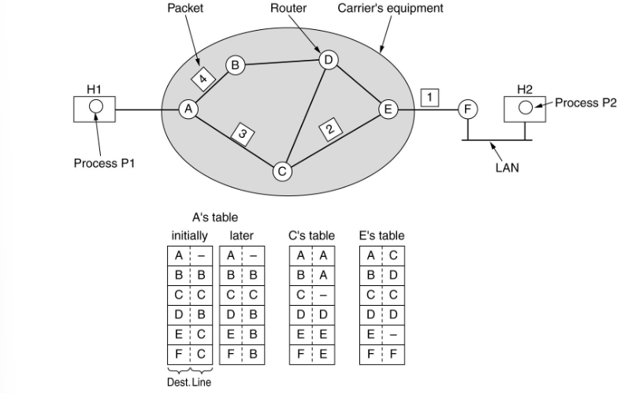
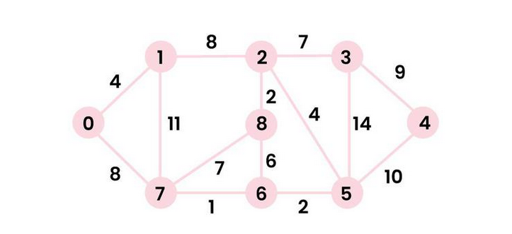
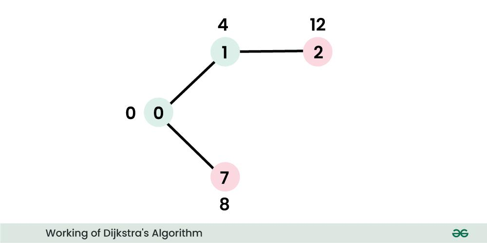

# Network Layer:
- Moves `packets` between `different` networks
- `Route` packets from sender to receiver across multiple paths and networks.

## Functions of the Network Layer:
- Assigning logical Address
- Packetizing
- Host-to-host delivery
- Forwarding
- Fragmentation and reassembly of packets
- logical subnetting
- network address transition
- routing
----

# Connection-orientated vs Connection-less

## Connection-Orientated Service

## Connection-less Service

| Issue                     | Connectionless                                        | Connection-orientated                                              |
|---------------------------|-------------------------------------------------------|--------------------------------------------------------------------|
| Circtuit Setup            | not needed                                            | required                                                           |
| Addressing                | Each packet contains source and destination address   | Each packen contains a short `VC (Virtual-Circuit)` number         |
| State Information         | Routers di not hold any information about connections | Each `VC` requires `router table space`  per connection            |
| Routing                   | Each packet is routed `independently`                 | Route chosen when `VC` setup, all packets follow it                |
| Effect of router failures | None, except for packets lost during crash            | All `VC`s that passed through the failed routers are terminated    |
| Quality of service        | Difficult                                             | Easy if enough resources can be allocated in advance for each `VC` |
| Congestion control        | Difficult                                             | Easy if enough resources can be allocated in advance for each `VC                                                                   |

----
# Routing Algorithms

## Dijkstra's Algorithm

### Step 1:
- sptSet = { }
- pick the `vertex` with the minimum cost and append it to `sptSet`, this is the first step => root vertex
- sptSet = {(v = 0, d = 0), } `(vertex, distance from vertex)`
- update the adjacent vertices from the picked vertex

### Step 2:
- sptSet = {(v = 0, d = 0)}
- Pick the vertex with minimum distance value and not already included in  SPT  (not in  `sptSET`). The `vertex 1` is picked and added to `sptSet`.
- sptSet = {(v = 0, d = 0), (v = 1, d = 4)}

### Step n: 
- repeat till the end
-----